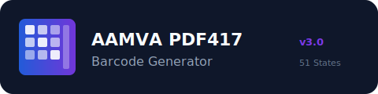

# AAMVA PDF417 Generator - Telegram Bot

<p align="center">
  
</p>

<p align="center">
  <strong>AAMVA PDF417 Barcode Generator</strong><br/>
  <em>Professional PDF417 barcode generation service for 51 US jurisdictions.</em>
</p>

<p align="center">
  
  
  
  
</p>

<p align="center">
  <a href="#business-model">Business Model</a> •
  <a href="#features">Features</a> •
  <a href="#architecture">Architecture</a> •
  <a href="#installation">Installation</a> •
  <a href="#configuration">Configuration</a> •
  <a href="#usage">Usage</a> •
  <a href="#monetization">Monetization</a>
</p>

---

## 💼 Business Model

**This Telegram bot enables you to:**

### 1. Personal Use
- Generate AAMVA-compliant PDF417 barcodes instantly
- Access all 51 US jurisdictions (50 states + DC)
- Support for 6 AAMVA versions (v03, v04, v06, v08, v09, v10)
- Save templates for repeated use
- Manage generation history
- Export in PNG format with copy-ready text

### 2. Service Provider / Business Opportunity
- **Run as a paid service** and earn money from barcode generation
- Built-in cryptocurrency payment system (BTC, LTC, USDT TRC-20)
- Credit-based monetization model
- Admin dashboard for complete business control
- User management and analytics
- Promo code system for marketing
- Broadcast messaging for customer engagement

**Real-World Applications:**
- Offer barcode generation as a Telegram service ($5-50 per barcode)
- Provide bulk generation packages for businesses
- Create monthly subscription plans using credit system
- White-label solution for resellers
- Automated passive income with minimal maintenance

---

## ✨ Features

### Core Capabilities

| Feature | Description |
|---------|-------------|
| **51 Jurisdictions** | All 50 US states + District of Columbia |
| **6 AAMVA Versions** | v03, v04, v06, v08, v09, v10 - full standard compliance |
| **PDF417 Engine** | State-specific ECC levels, column counts, aspect ratios |
| **Smart DL Generation** | Soundex, letter-digit, numeric formats per state algorithm |
| **DD/DCF Generator** | Automatic document discriminator calculation |
| **ICN/DCK Generator** | Inventory control number generation |
| **DCJ Generator** | Jurisdiction-specific document classifier |

### Advanced Technology

| Technology | Implementation |
|------------|----------------|
| **ML Anomaly Detection** | IsolationForest (scikit-learn) + statistical fallback |
| **NLP Engine** | 15-intent classifier with fuzzy state matching |
| **Sentiment Analysis** | User feedback processing |
| **Smart Wizard** | 20-step conditional generation flow |
| **Auto-Validation** | 200+ inline assertions for data integrity |

### Business Features

| Feature | Benefit |
|---------|---------|
| **Payment Processing** | BTC, LTC, USDT (TRC-20) with QR invoices |
| **Credit System** | Flexible pricing and package management |
| **Admin Dashboard** | Revenue tracking, user analytics, system stats |
| **Promo Codes** | Unlimited/limited use, percentage/fixed discounts |
| **Broadcast System** | Mass messaging for announcements and marketing |
| **Transaction Logs** | Complete audit trail of all operations |

### User Experience

| Feature | Description |
|---------|-------------|
| **Template System** | Save, load, share, delete custom templates |
| **Favorites** | Quick access to frequently used states |
| **History** | Re-download past generations, export to TXT |
| **Copy-Ready Output** | One-click text copying for easy data transfer |
| **Natural Language** | "make texas barcode" - no complex commands |

---

## 🏗️ Architecture
┌─────────────────────────────────────────────────────────────┐
│ TELEGRAM BOT API │
└──────────────────────┬──────────────────────────────────────┘
│
┌──────────────▼───────────────┐
│ NLP ENGINE │
│ • 15 Intent Classifier │
│ • Fuzzy State Matching │
│ • Sentiment Analysis │
└──────────────┬───────────────┘
│
┌──────────────▼───────────────┐
│ GENERATION WIZARD │
│ • 20-Step Conditional Flow │
│ • State-Specific Validation │
│ • Template Integration │
└──────────────┬───────────────┘
│
┌──────────────▼───────────────┐
│ AUTO-CALCULATOR │
│ • DL Number (per-state) │
│ • DD/DCF Document ID │
│ • ICN/DCK Inventory │
│ • DCJ Jurisdiction Code │
└──────────────┬───────────────┘
│
┌──────────────▼───────────────┐
│ ML ANOMALY DETECTOR │
│ • IsolationForest Model │
│ • 6 Rule-Based Checks │
│ • Statistical Z-Score │
└──────────────┬───────────────┘
│
┌──────────────▼───────────────┐
│ AAMVA BUILDER │
│ • 51 State Specifications │
│ • 6 Version Formats │
│ • Subfile Management │
└──────────────┬───────────────┘
│
┌──────────────▼───────────────┐
│ PDF417 RENDERER │
│ • State-Specific ECC │
│ • Column Count Optimization │
│ • Aspect Ratio Adjustment │
└──────────────┬───────────────┘
│
┌──────────────▼───────────────┐
│ SESSION MANAGER │
│ • TTL-Based Expiry │
│ • Thread-Safe Operations │
│ • Rate Limiting │
└──────────────┬───────────────┘
│
┌──────────────▼───────────────┐
│ SQLite DATABASE (WAL) │
│ • 12 Tables │
│ • ACID Compliance │
│ • Auto-Migration │
└───────────────────────────────┘

---

## 🚀 Installation

### Prerequisites

- **Python 3.10 or higher**
- **Telegram Bot Token** from [@BotFather](https://t.me/BotFather)
- **Cryptocurrency Wallets** (optional, for payments)

### Step 1: Clone Repository

```bash
git clone https://github.com/yourusername/aamva-pdf417-generator.git
cd aamva-pdf417-generator

python3 -m venv venv
source venv/bin/activate
Windows:

cmd

python -m venv venv
venv\Scripts\activate
Step 3: Install Dependencies
Bash

pip install -r requirements.txt
Dependencies installed:

python-telegram-bot==21.3 - Telegram Bot API wrapper
Pillow==10.4.0 - Image processing
qrcode==8.0 - QR code generation for payments
pdf417gen==0.7.1 - PDF417 barcode rendering
scikit-learn==1.5.1 - ML anomaly detection
numpy==2.0.1 - Numerical operations

Configuration Variables
Variable	Default	Description	Example
TG_TOKEN	(required)	Telegram Bot Token from BotFather	1234567890:ABC...
ADMIN_IDS	[]	Comma-separated Telegram user IDs	123456789,987654321
ACCESS_MODE	open	User registration mode	open, approve, invite
WEBHOOK_URL	""	HTTPS URL for webhook mode	https://bot.example.com
PORT	8443	Webhook listening port	8443, 443, 80, 88
Access Modes Explained
1. open Mode (Default)

Anyone can register and use the bot immediately
No approval needed
Best for public services
2. approve Mode

Users can register but need admin approval
Pending users shown in admin dashboard
Admin can approve/reject with /admin
3. invite Mode

Users need an invite code to register
Admin generates codes with /adminpromo
Most restrictive, best for exclusive services

💰 Monetization Setup
Payment Configuration
Edit bot.py to configure your payment system:

💰 Monetization Setup
Payment Configuration
Edit bot.py to configure your payment system:

# Credit Package Pricing
CREDIT_PACKAGES = {
    "5": {
        "credits": 5,
        "btc": 0.001,      # 5 credits = 0.001 BTC
        "ltc": 0.05,       # 5 credits = 0.05 LTC
        "usdt": 25         # 5 credits = 25 USDT
    },
    "10": {
        "credits": 10,
        "btc": 0.0018,     # Bulk discount
        "ltc": 0.09,
        "usdt": 45
    },
    "25": {
        "credits": 25,
        "btc": 0.004,
        "ltc": 0.20,
        "usdt": 100
    },
    "50": {
        "credits": 50,
        "btc": 0.0075,
        "ltc": 0.38,
        "usdt": 190
    },
    "100": {
        "credits": 100,
        "btc": 0.014,
        "ltc": 0.70,
        "usdt": 350
    }
}

# Your Payment Wallets
PAYMENT_WALLETS = {
    "BTC": "bc1qxy2kgdygjrsqtzq2n0yrf2493p83kkfjhx0wlh",
    "LTC": "LTC1234567890abcdefghijklmnopqrstuvwx",
    "USDT_TRC20": "TR7NHqjeKQxGTCi8q8ZY4pL8otSzgjLj6t"
}

# Credit Cost per Generation
GENERATION_COST = 1  # 1 credit per barcode

Pricing Strategy Examples
Budget Service ($5-10 per barcode):

Premium Service ($25-50 per barcode):

Bulk Packages:
"100": {"credits": 100, "btc": 0.01, "usdt": 300}  # $3 per barcode

📱 Usage Guide
User Commands
Command	Function	Example
/start	Welcome message & quick actions	/start
/register	Create new account	/register
/login	Sign in to existing account	/login
/generate	Start barcode wizard	/generate
/buy	Purchase credits	/buy
/balance	Check credit balance	/balance
/history	View past generations	/history
/template	Manage saved templates	/template
/favorite	Add/remove favorite states	/favorite
/states	Browse all 51 jurisdictions	/states
/redeem	Redeem promo code	/redeem SUMMER50
/profile	View account details	/profile
/help	Complete user guide	/help
Admin Commands
Command	Function	Access
/admin	Main admin dashboard	Admin only
/adminlogin	Authenticate as admin	Admin only
/adminpromo	Create promo codes	Admin only
/adminbroadcast	Send mass message	Admin only
Natural Language Interface
Users can generate barcodes using natural language:

"make a barcode for Texas"
"generate california"
"I want a New York barcode"
"create FL"
"texas please"

The NLP engine automatically:

Detects intent to generate
Identifies state from text
Starts the generation wizard
🎯 Generation Workflow
Step-by-Step Process
1. Initiate Generation

User: /generate
Bot: Select a state from 51 jurisdictions
2. State Selection


User: [Selects Texas]
Bot: Select AAMVA version (v03-v10)
3. Version Selection


User: [Selects v09]
Bot: Enter first name
4. Data Collection (20 Steps)

First Name
Middle Name (optional)
Last Name
Date of Birth
Sex
Eye Color
Height
Weight
Address Line 1
Address Line 2 (optional)
City
State
ZIP Code
Issue Date
Expiration Date
Document Discriminator (auto-generated or custom)
Driver License Number (auto-generated or custom)
Inventory Control Number (optional)
Additional fields based on AAMVA version
5. Confirmation


Bot: [Shows all entered data]
     Confirm generation? (Cost: 1 credit)
User: ✅ Confirm
6. Output


Bot: [Sends PNG barcode image]
     [Sends formatted  data]
     [Copy  button]
     [Save as template button]
🎨 Template System
Save Templates
After generating a barcode:


Bot: Save as template?
User: [Clicks "Save Template"]
Bot: Enter template name
User: "John Doe - Texas"
Bot: ✅ Template saved
Load Templates


User: /template
Bot: [Shows saved templates]
     1. John Doe - Texas
     2. Jane Smith - California
User: [Selects template]
Bot: Load this template?
User: ✅ Load
Bot: [Pre-fills generation wizard]
Share Templates


User: /template
Bot: [Shows templates]
User: [Selects "John Doe - Texas"]
Bot: Share | Load | Delete
User: [Clicks Share]
Bot: Template code: TPL_ABC123XYZ
Another user:


User: /template
User: [Clicks "Import Template"]
User: TPL_ABC123XYZ
Bot: ✅ Template imported
💳 Payment System
Purchase Flow
1. Check Balance


User: /balance
Bot: Current balance: 0 credits
     Click /buy to purchase
2. Select Package


User: /buy
Bot: Select credit package:
     • 5 credits - 25 USDT
     • 10 credits - 45 USDT
     • 25 credits - 100 USDT
     • 50 credits - 190 USDT
3. Choose Payment Method


User: [Selects 10 credits]
Bot: Select payment method:
     • Bitcoin (BTC)
     • Litecoin (LTC)
     • Tether (USDT TRC-20)
4. Payment Invoice


User: [Selects USDT]
Bot: [QR Code Image]
     
     Send exactly: 45.00 USDT
     To address: TR7NHqje...
     Network: TRC-20 (Tron)
     
     Payment ID: PAY_1234567890
     
     After payment, send transaction hash:
5. Confirm Payment


User: abc123def456...
Bot: ✅ Payment received!
     10 credits added to your account
     New balance: 10 credits
👨‍💼 Admin Dashboard
Access Dashboard


Admin: /adminlogin
Bot: Enter admin password
Admin: [enters password]
Bot: ✅ Admin authenticated

Admin: /admin
Dashboard Overview


━━━━━━━━━━━━━━━━━━━━━━━━
📊 ADMIN DASHBOARD
━━━━━━━━━━━━━━━━━━━━━━━━

👥 Users: 127 total
   • Active: 94
   • Pending: 8
   • Banned: 2

💰 Revenue (Last 30 Days)
   • BTC: 0.0847
   • LTC: 4.32
   • USDT: 3,450

📈 Generations
   • Today: 47
   • This Week: 312
   • This Month: 1,248

🎫 Active Promos: 3
📢 Last Broadcast: 2 days ago

[User Management]
[Promo Codes]
[Broadcast]
[Analytics]
[System Settings]
User Management


Admin: [Clicks User Management]
Bot: Search user by ID or username
Admin: john_doe
Bot: User: @john_doe (ID: 123456789)
     Balance: 5 credits
     Joined: 2025-01-15
     Generations: 12
     Status: Active
     
     [Add Credits]
     [Ban User]
     [View History]
Create Promo Code


Admin: /adminpromo
Bot: Promo code creation wizard
     
     1. Enter code name
Admin: SUMMER50

     2. Select type
Admin: [Percentage Discount]

     3. Enter discount (%)
Admin: 50

     4. Max uses (0 = unlimited)
Admin: 100

     5. Expiry date (YYYY-MM-DD)
Admin: 2025-12-31

Bot: ✅ Promo code created
     Code: SUMMER50
     Type: 50% off
     Max uses: 100
     Expires: 2025-12-31
Broadcast Message


Admin: /adminbroadcast
Bot: Enter message to broadcast
Admin: 🎉 New Year Sale! 50% off all packages
       Use code: NEWYEAR50
       
Bot: Preview:
     ━━━━━━━━━━━━━━━━━
     🎉 New Year Sale! 50% off all packages
     Use code: NEWYEAR50
     ━━━━━━━━━━━━━━━━━
     
     Send to 127 users?
Admin: ✅ Confirm
Bot: Broadcasting... 127/127 sent ✅
📊 Analytics & Reports
Revenue Analytics


Admin: [Dashboard → Analytics]
Bot: 
     📈 REVENUE REPORT
     ━━━━━━━━━━━━━━━━━━
     
     Today:
     • BTC: 0.0021 ($84)
     • LTC: 0.15 ($18)
     • USDT: 125
     Total: $227
     
     This Week:
     • BTC: 0.0147 ($588)
     • LTC: 1.05 ($126)
     • USDT: 875
     Total: $1,589
     
     This Month:
     • BTC: 0.0847 ($3,388)
     • LTC: 4.32 ($518)
     • USDT: 3,450
     Total: $7,356
     
     [Export CSV]
     [Detailed Report]
User Acquisition


Admin: [Analytics → User Growth]
Bot:
     👥 USER GROWTH
     ━━━━━━━━━━━━━━━━━━
     
     New users this week: 23
     
     Mon: 4 users
     Tue: 6 users
     Wed: 3 users
     Thu: 5 users
     Fri: 2 users
     Sat: 1 user
     Sun: 2 users
     
     Retention rate: 74%
     Avg. credits purchased: 18.5
🔐 Security Features
Authentication
User Authentication:

PBKDF2-SHA256 password hashing
100,000 iterations
Random salt per password
Session-based authentication
Admin Authentication:

Separate admin password system
Session timeout (configurable)
Failed login attempt limiting
Rate Limiting
Python

RATE_LIMITS = {
    "generation": 10,      # 10 per hour
    "registration": 3,     # 3 per day
    "login_attempts": 5,   # 5 per hour
    "payment": 5           # 5 per hour
}
Data Protection
SQL injection prevention (parameterized queries)
Input sanitization on all fields
Thread-safe database operations
ACID compliance with SQLite WAL mode
Automatic database backups
🗄️ Database Schema
12 Tables Overview
1. users

SQL

CREATE TABLE users (
    telegram_id INTEGER PRIMARY KEY,
    username TEXT,
    first_name TEXT,
    balance INTEGER DEFAULT 0,
    joined_date TEXT,
    status TEXT DEFAULT 'active'
);
2. auth_users

SQL

CREATE TABLE auth_users (
    id INTEGER PRIMARY KEY,
    telegram_id INTEGER,
    password_hash TEXT,
    salt TEXT,
    created_date TEXT
);
3. payments

SQL

CREATE TABLE payments (
    id INTEGER PRIMARY KEY,
    telegram_id INTEGER,
    payment_id TEXT UNIQUE,
    amount REAL,
    currency TEXT,
    credits INTEGER,
    status TEXT,
    created_date TEXT,
    confirmed_date TEXT
);
4. transactions

SQL

CREATE TABLE transactions (
    id INTEGER PRIMARY KEY,
    telegram_id INTEGER,
    type TEXT,
    amount INTEGER,
    balance_after INTEGER,
    description TEXT,
    created_date TEXT
);
5. generations

SQL

CREATE TABLE generations (
    id INTEGER PRIMARY KEY,
    telegram_id INTEGER,
    state TEXT,
    aamva_version TEXT,
    data TEXT,
    barcode_path TEXT,
    created_date TEXT
);
6. promos

SQL

CREATE TABLE promos (
    id INTEGER PRIMARY KEY,
    code TEXT UNIQUE,
    type TEXT,
    value REAL,
    max_uses INTEGER,
    uses INTEGER DEFAULT 0,
    expiry_date TEXT,
    created_by INTEGER,
    created_date TEXT
);
7. promo_uses

SQL

CREATE TABLE promo_uses (
    id INTEGER PRIMARY KEY,
    promo_id INTEGER,
    telegram_id INTEGER,
    used_date TEXT,
    FOREIGN KEY(promo_id) REFERENCES promos(id)
);
8. admin_accounts

SQL

CREATE TABLE admin_accounts (
    id INTEGER PRIMARY KEY,
    telegram_id INTEGER UNIQUE,
    password_hash TEXT,
    salt TEXT,
    created_date TEXT
);
9. templates

SQL

CREATE TABLE templates (
    id INTEGER PRIMARY KEY,
    telegram_id INTEGER,
    name TEXT,
    template_code TEXT UNIQUE,
    data TEXT,
    created_date TEXT,
    is_public INTEGER DEFAULT 0
);
10. favorites

SQL

CREATE TABLE favorites (
    id INTEGER PRIMARY KEY,
    telegram_id INTEGER,
    state TEXT,
    added_date TEXT,
    UNIQUE(telegram_id, state)
);
11. analytics

SQL

CREATE TABLE analytics (
    id INTEGER PRIMARY KEY,
    event_type TEXT,
    telegram_id INTEGER,
    data TEXT,
    created_date TEXT
);
12. anomaly_logs

SQL

CREATE TABLE anomaly_logs (
    id INTEGER PRIMARY KEY,
    telegram_id INTEGER,
    generation_id INTEGER,
    anomaly_type TEXT,
    severity TEXT,
    details TEXT,
    created_date TEXT
);
🤖 ML Anomaly Detection
How It Works
IsolationForest Model:

Trained on 500 synthetic demographic samples
Features: height, weight, age, sex
Detects outliers in physical characteristics
Rule-Based Checks:

Height range: 48-84 inches
Weight range: 50-500 lbs
Age range: 16-120 years
Height-weight ratio validation
Age-physical characteristic correlation
Sex-specific norms
Severity Levels:

ERROR: Blocks generation (e.g., height = 10 inches)
WARNING: Allows with warning (e.g., weight = 495 lbs)
INFO: Logs for monitoring (e.g., unusual but valid)
Fallback System:
If scikit-learn unavailable:

Statistical z-score calculation
Mean and standard deviation from training data
Same severity thresholds
Example Detection


User enters:
- Height: 72 inches
- Weight: 95 lbs
- Age: 25
- Sex: M

ML Output:
⚠️ WARNING: Anomaly detected
   Unusually low weight for height
   Anomaly score: -0.34
   Proceed anyway?
🌎 Supported Jurisdictions
All 51 US Jurisdictions
State	Code	AAMVA Versions	
Alabama	AL	v03-v10	
Alaska	AK	v03-v10	
Arizona	AZ	v03-v10	
Arkansas	AR	v03-v10	
California	CA	v03-v10	
Colorado	CO	v03-v10	
Connecticut	CT	v03-v10	
Delaware	DE	v03-v10	
District of Columbia	DC	v03-v10	
Florida	FL	v03-v10	
Georgia	GA	v03-v10	
Hawaii	HI	v03-v10	
Idaho	ID	v03-v10	
Illinois	IL	v03-v10	
Indiana	IN	v03-v10	
Iowa	IA	v03-v10	
Kansas	KS	v03-v10	
Kentucky	KY	v03-v10	
Louisiana	LA	v03-v10	
Maine	ME	v03-v10	
Maryland	MD	v03-v10	
Massachusetts	MA	v03-v10	
Michigan	MI	v03-v10	
Minnesota	MN	v03-v10	
Mississippi	MS	v03-v10	
Missouri	MO	v03-v10	
Montana	MT	v03-v10	
Nebraska	NE	v03-v10	
Nevada	NV	v03-v10	
New Hampshire	NH	v03-v10	
New Jersey	NJ	v03-v10	
New Mexico	NM	v03-v10	
New York	NY	v03-v10	
North Carolina	NC	v03-v10	
North Dakota	ND	v03-v10	
Ohio	OH	v03-v10	
Oklahoma	OK	v03-v10	
Oregon	OR	v03-v10	
Pennsylvania	PA	v03-v10	
Rhode Island	RI	v03-v10	
South Carolina	SC	v03-v10	
South Dakota	SD	v03-v10	
Tennessee	TN	v03-v10	
Texas	TX	v03-v10	
Utah	UT	v03-v10	
Vermont	VT	v03-v10	
Virginia	VA	v03-v10	
Washington	WA	v03-v10	
West Virginia	WV	v03-v10	
Wisconsin	WI	v03-v10	
Wyoming	WY	v03-v10	

📊 Business Metrics
Key Performance Indicators
Track these metrics from admin dashboard:

Revenue Metrics:

Daily/Weekly/Monthly revenue by currency
Average transaction value
Revenue per user
Conversion rate (visitors to paying customers)
User Metrics:

Total registered users
Active users (generated in last 30 days)
New user acquisition rate
User retention rate
Churn rate
Operational Metrics:

Generations per day/week/month
Average credits per transaction
Promo code redemption rate
Popular states (generation frequency)
Peak usage hours
Example Monthly Report:

📊 Business Metrics
Key Performance Indicators
Track these metrics from admin dashboard:

Revenue Metrics:

Daily/Weekly/Monthly revenue by currency
Average transaction value
Revenue per user
Conversion rate (visitors to paying customers)
User Metrics:

Total registered users
Active users (generated in last 30 days)
New user acquisition rate
User retention rate
Churn rate
Operational Metrics:

Generations per day/week/month
Average credits per transaction
Promo code redemption rate
Popular states (generation frequency)
Peak usage hours
Example Monthly Report:

🚀 Deployment
Production Checklist
 Set strong admin password
 Configure real cryptocurrency wallets
 Set appropriate credit pricing
 Enable webhook mode for reliability
 Set up SSL certificate
 Configure database backups
 Set up monitoring/alerting
 Configure rate limits
 Review access mode (open/approve/invite)
 Test payment flow end-to-end
 Set up admin Telegram notifications
 Document recovery procedures
Systemd Service (Linux)
Create /etc/systemd/system/aamva-bot.service:

[Unit]
Description=AAMVA PDF417 Generator Bot
After=network.target

[Service]
Type=simple
User=botuser
WorkingDirectory=/home/botuser/aamva-pdf417-generator
Environment="TG_TOKEN=your_token_here"
Environment="ADMIN_IDS=123456789"
ExecStart=/home/botuser/aamva-pdf417-generator/venv/bin/python bot.py
Restart=always
RestartSec=10

[Install]
WantedBy=multi-user.target

📄 License
MIT License - See LICENSE file

🤝 Contributing
See CONTRIBUTING.md

🔐 Security
See SECURITY.md

📜 Terms
See TERMS.md

📞 Support
GitHub Issues: Report bugs or request features
Discussions: Community support
<p align="center"> <sub>Professional barcode generation service. Deploy, customize, and monetize.</sub> </p> ``


